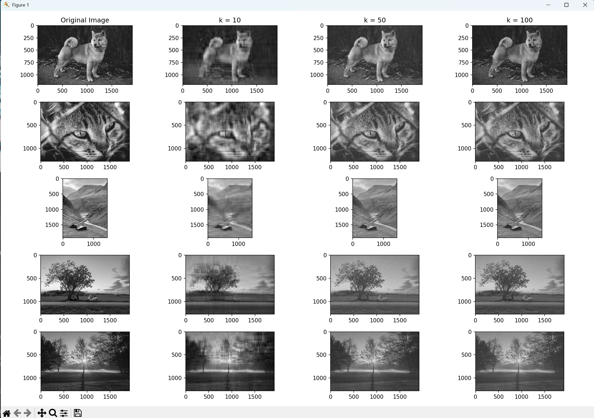
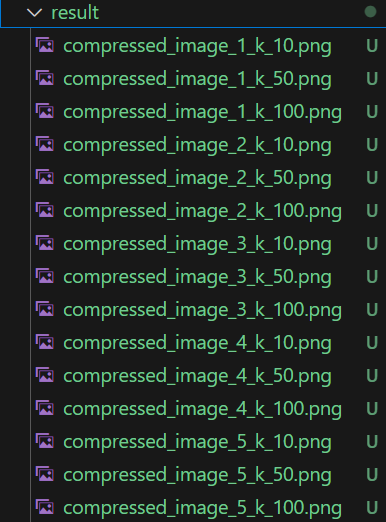

# SVD 实现图像压缩

## 实验过程

### 1. 读取图片

```python
img = cv2.imread('image.jpg')
```

### 2.执行奇异值分解

```python
U, s, Vt = np.linalg.svd(image)
```

- U: 左奇异向量矩阵，大小为 (m, m)。
- s: 奇异值向量，大小为 (m,)。
- Vt: 右奇异向量矩阵的转置，大小为 (n, n)。

### 3. 选择前 k 个奇异向量

```python
Uk = U[:, :k]
```

### 4.构建奇异值对角矩阵

```python
sk = np.diag(s[:k])
```

### 5. 截取右奇异向量矩阵的前 k 行

```python
Vtk = Vt[:k, :]
```

### 6. 重构图像

```python
reconstructed_image = np.dot(Uk, np.dot(sk, Vtk))
```

### 7. 使用 Matplotlib 显示图像并将其保存为 PNG 文件

```python
plt.imshow(reconstructed_image, cmap='gray')
plt.axis('off')  # 关闭坐标轴
plt.savefig('reconstructed_image.png', bbox_inches='tight', pad_inches=0)  # 保存为 PNG 文件
```

## 输出结果



